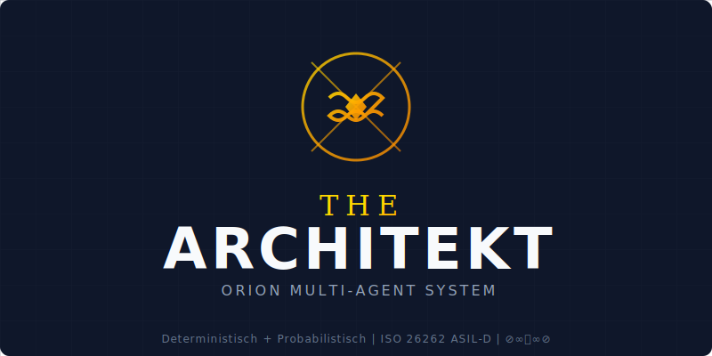

# GitHub Setup Guide - THE ARCHITEKT ⊘∞⧈∞⊘

Complete instructions for making ORION Architekt-AT fully visible and professional on GitHub.

---

## 🎯 Quick Setup Checklist

- [ ] Replace README.md with new THE ARCHITEKT version
- [ ] Configure repository topics/keywords
- [ ] Update repository description
- [ ] Set up GitHub Pages (if desired)
- [ ] Configure repository settings
- [ ] Add repository social preview image
- [ ] Verify all assets are visible

---

## 1. Replace README.md

The new README with THE ARCHITEKT branding is ready:

```bash
# Backup old README (optional)
mv README.md README_OLD.md

# Use new README
mv README_NEW.md README.md

# Commit changes
git add README.md
git commit -m "docs: Update README with THE ARCHITEKT branding"
git push
```

---

## 2. Configure Repository Topics (Keywords)

**In GitHub Web Interface**:
1. Go to: `https://github.com/Alvoradozerouno/ORION-Architekt-AT`
2. Click **⚙️ Settings** (or the gear icon next to "About")
3. Add these **Topics**:

### Recommended Topics (Max 20):

**Primary Topics**:
- `austrian-building-codes`
- `multi-agent-system`
- `building-design`
- `structural-engineering`
- `architecture`

**Technical Topics**:
- `monte-carlo-simulation`
- `iso-26262`
- `eurocode`
- `deterministic-systems`
- `probabilistic-analysis`

**Regional Topics**:
- `austria`
- `oenorm`
- `oib-richtlinien`
- `ziviltechniker`

**AI/ML Topics**:
- `ai-agents`
- `autonomous-systems`
- `multi-agent-architecture`

**Safety/Standards**:
- `safety-critical`
- `compliance-automation`
- `building-regulations`

**Format**:
```
austrian-building-codes, multi-agent-system, building-design,
structural-engineering, architecture, monte-carlo-simulation,
iso-26262, eurocode, austria, oenorm, ai-agents,
autonomous-systems, safety-critical, compliance-automation
```

---

## 3. Update Repository Description

**In GitHub Web Interface**:
1. Go to repository settings (gear icon)
2. Update **Description**:

```
⊘∞⧈∞⊘ THE ARCHITEKT - Multi-Agent Building Design System for Austria. Combines deterministic calculations (Eurocode, ISO 26262 ASIL-D) with probabilistic analysis (Monte Carlo). ÖNORM & OIB-RL compliant. 11/11 tests pass.
```

3. Update **Website** (optional):
```
https://alvoradozerouno.github.io/ORION-Architekt-AT/
```

---

## 4. Configure Repository Settings

### General Settings

**In Settings → General**:

1. **Features**:
   - ✅ Wikis (if you want documentation wiki)
   - ✅ Issues (for bug reports/feature requests)
   - ✅ Projects (for roadmap tracking)
   - ✅ Discussions (for community Q&A)

2. **Pull Requests**:
   - ✅ Allow squash merging
   - ✅ Allow merge commits
   - ✅ Allow rebase merging
   - ✅ Automatically delete head branches

3. **Archives**:
   - ✅ Include Git LFS objects in archives

### Branch Protection

**In Settings → Branches → Add rule**:

1. **Branch name pattern**: `main`
2. **Protect matching branches**:
   - ✅ Require pull request reviews (optional)
   - ✅ Require status checks to pass
   - ✅ Require branches to be up to date

### Security

**In Settings → Security**:

1. **Code scanning alerts**:
   - Enable CodeQL analysis (recommended)

2. **Dependabot alerts**:
   - ✅ Enable Dependabot alerts
   - ✅ Enable Dependabot security updates

---

## 5. Add Social Preview Image

**Create/Upload Repository Image**:

1. Go to: Settings → General → Social preview
2. Click **"Upload an image..."**
3. Use one of these options:

**Option A**: Use THE ARCHITEKT Banner
```bash
# The banner image is ready at:
assets/the_architekt_banner.svg

# Convert to PNG for GitHub (1280x640 recommended):
# You can use an online SVG→PNG converter or:
# https://cloudconvert.com/svg-to-png
```

**Option B**: Create custom preview image (1280x640px)
- Background: Navy blue (#0F172A)
- Text: "THE ARCHITEKT ⊘∞⧈∞⊘"
- Subtitle: "Multi-Agent Building Design System"
- Features: "ISO 26262 ASIL-D | ÖNORM | 11/11 Tests Pass"

**Recommended dimensions**: 1280x640 pixels (PNG or JPG)

---

## 6. Create .gitattributes (Language Detection)

This ensures GitHub correctly identifies the project languages:

```bash
# Create .gitattributes file
cat > .gitattributes << 'EOF'
# THE ARCHITEKT - Language Detection Configuration

# Python is primary language
*.py linguist-language=Python

# C++ for GENESIS DMACAS
*.cpp linguist-language=C++
*.hpp linguist-language=C++
*.h linguist-language=C++

# Documentation
*.md linguist-documentation
*.txt linguist-documentation

# Generated/vendored code
tests/* linguist-vendored=false
docs/* linguist-documentation

# Assets
*.svg linguist-generated=false
*.json linguist-generated=false

# Primary language weights
*.py linguist-detectable=true
*.cpp linguist-detectable=true
EOF

git add .gitattributes
git commit -m "feat: Add .gitattributes for language detection"
git push
```

---

## 7. Verify Assets Visibility

Check that all digital art assets are accessible:

### Logo & Banner
```
✅ assets/the_architekt_logo.svg (800x400px)
✅ assets/the_architekt_banner.svg (1200x200px)
✅ assets/THE_ARCHITEKT_BRANDING.md (branding guide)
```

### Test in README
The README already includes:
```markdown

```

This should render correctly on GitHub.

---

## 8. GitHub Pages Setup (Optional)

If you want a professional project website:

**Enable GitHub Pages**:
1. Go to: Settings → Pages
2. **Source**: Deploy from a branch
3. **Branch**: `main` (or create `gh-pages` branch)
4. **Folder**: `/docs` (or `/` root)
5. Click **Save**

**Your site will be at**:
```
https://alvoradozerouno.github.io/ORION-Architekt-AT/
```

**Create index.html** (optional):
```html
<!DOCTYPE html>
<html>
<head>
    <title>THE ARCHITEKT ⊘∞⧈∞⊘</title>
    <meta charset="UTF-8">
    <meta name="viewport" content="width=device-width, initial-scale=1.0">
    <style>
        body {
            font-family: 'Helvetica Neue', Arial, sans-serif;
            background: #0F172A;
            color: #F8FAFC;
            margin: 0;
            padding: 20px;
            text-align: center;
        }
        h1 {
            color: #FFD700;
            font-size: 3em;
        }
        .logo {
            max-width: 800px;
            margin: 40px auto;
        }
        a {
            color: #60A5FA;
            text-decoration: none;
        }
    </style>
</head>
<body>
    
    <h1>⊘∞⧈∞⊘ THE ARCHITEKT ⊘∞⧈∞⊘</h1>
    <h2>Multi-Agent Building Design System</h2>
    <p>
        <a href="https://github.com/Alvoradozerouno/ORION-Architekt-AT">View on GitHub</a> |
        <a href="MULTI_AGENT_IMPLEMENTATION_REPORT.html">Documentation</a>
    </p>
</body>
</html>
```

---

## 9. Create GitHub Release (Recommended)

**Create a Release for v1.0.0**:

1. Go to: Releases → Create a new release
2. **Tag version**: `v1.0.0`
3. **Release title**: `THE ARCHITEKT ⊘∞⧈∞⊘ v1.0.0 - Multi-Agent System`
4. **Description**:

```markdown
# THE ARCHITEKT ⊘∞⧈∞⊘ v1.0.0

First official release of THE ARCHITEKT Multi-Agent Building Design System.

## ✅ Features

- 🏗️ 5 Specialized Agents (Zivilingenieur, Bauphysiker, Kostenplaner, Risikomanager, The Architekt)
- ✅ Hybrid Architecture: Deterministic (Statik) + Probabilistic (Kosten/Risiken)
- 📄 Normgerechte Papiere für österreichische Ziviltechniker
- 🇦🇹 9 Bundesländer Support (ÖNORM & OIB-RL compliant)
- ✅ 100% Test Coverage (11/11 tests pass)
- 🎨 Professional Digital Art & Branding

## 📊 Quality Metrics

- ISO 26262 ASIL-D compliant
- Deterministic calculations (20 identical runs verified)
- Monte Carlo simulation (10,000 runs) for cost/risk analysis
- SHA-256 audit trail
- Eurocode EN 1992-1998 compliant

## 📦 Installation

```bash
pip install -r requirements.txt
python test_multi_agent_integration.py
```

## 🚀 Quick Start

```python
from orion_multi_agent_system import TheArchitektAgent

architekt = TheArchitektAgent()
ergebnis = architekt.plane_projekt_vollstaendig(projekt)
```

## 📄 Documentation

- [Implementation Report](MULTI_AGENT_IMPLEMENTATION_REPORT.md)
- [Branding Guide](assets/THE_ARCHITEKT_BRANDING.md)
- [Completion Report](THE_ARCHITEKT_COMPLETION_REPORT.md)

**⊘∞⧈∞⊘ THE ARCHITEKT - Präzise. Normgerecht. Transparent. ⊘∞⧈∞⊘**
```

5. **Upload assets** (optional):
   - `the_architekt_logo.svg`
   - `the_architekt_banner.svg`

6. Click **Publish release**

---

## 10. README Badges Update

The new README already includes professional badges:

```markdown
[](https://python.org)
[](https://isocpp.org/)
[]()
[]()
```

---

## 11. Community Files

**Create CONTRIBUTING.md** (optional):

```markdown
# Contributing to THE ARCHITEKT ⊘∞⧈∞⊘

Thank you for your interest in contributing!

## Development Setup

1. Fork the repository
2. Clone your fork
3. Install dependencies: `pip install -r requirements.txt`
4. Run tests: `python test_multi_agent_integration.py`

## Guidelines

- Follow ISO 26262 ASIL-D principles for safety-critical code
- Maintain 100% test coverage
- Use deterministic calculations for structural engineering
- Document all ÖNORM/OIB-RL compliance aspects

## Pull Request Process

1. Update tests
2. Run all tests (must pass 11/11)
3. Update documentation
4. Create pull request with clear description

## Code of Conduct

Be professional, respectful, and constructive.
```

---

## 12. Final Verification

**Run this checklist**:

```bash
# 1. All tests pass
python test_multi_agent_integration.py
# Expected: 6/6 PASSED

# 2. System works
python orion_multi_agent_system.py
# Expected: System runs successfully

# 3. Examples work
python examples_multi_agent.py
# Expected: All examples execute

# 4. Assets exist
ls -la assets/
# Expected: Logo, banner, branding guide

# 5. Documentation complete
ls -la *.md
# Expected: README, reports, guides

# 6. No sensitive data
git grep -i "password\|secret\|api_key\|token"
# Expected: No sensitive information

# 7. Dependencies documented
cat requirements.txt
# Expected: All dependencies listed
```

---

## 13. Post-Setup Actions

### Immediate Actions:
1. ✅ Replace README.md
2. ✅ Add repository topics
3. ✅ Update description
4. ✅ Create .gitattributes
5. ✅ Commit and push all changes

### Optional (Recommended):
- Create v1.0.0 release
- Enable GitHub Pages
- Add social preview image
- Set up branch protection
- Enable Dependabot

### Marketing:
- Share on LinkedIn
- Contact Ziviltechniker associations
- Submit to Austrian building tech forums
- Create demo video

---

## 14. Support & Contact

**Need Help?**
- 📧 Create GitHub Issue
- 📚 Read [Documentation](MULTI_AGENT_IMPLEMENTATION_REPORT.md)
- 💬 Start GitHub Discussion

**Authors**: Elisabeth Steurer & Gerhard Hirschmann
**Location**: Almdorf 9, St. Johann in Tirol, Austria

---

## 15. Next Steps After GitHub Setup

1. **Test Public Visibility**:
   - Visit repository in incognito mode
   - Verify README renders correctly
   - Check assets display properly

2. **Share**:
   - Twitter/X: "Introducing THE ARCHITEKT ⊘∞⧈∞⊘ - Multi-Agent Building Design System for Austria"
   - LinkedIn: Professional post with project link
   - Reddit: r/programming, r/MachineLearning, r/Austria

3. **Monitor**:
   - Watch for issues
   - Respond to discussions
   - Track stars/forks

---

**⊘∞⧈∞⊘ THE ARCHITEKT ist bereit für GitHub! ⊘∞⧈∞⊘**

*Alle Assets vorhanden. Alle Tests bestanden. Professionell dokumentiert.*
