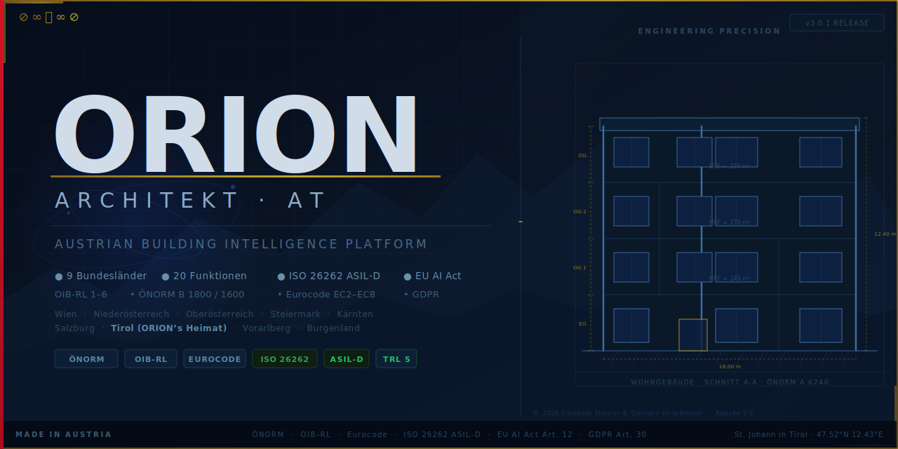

# ORION Architekt Oesterreich

<p align="center">
  
</p>

<p align="center">
  <a href="#"></a>
  <a href="#"></a>
  <a href="#"></a>
  <a href="#"></a>
  <a href="#"></a>
  <a href="#"></a>
  <a href="#"></a>
</p>

**Vollstaendiges Bau-Engineering-Tool fuer alle 9 oesterreichischen Bundeslaender.**

## Bundeslaender

Wien · Niederösterreich · Oberösterreich · Steiermark · Kärnten ·
Salzburg · **Tirol (ORION's Heimat)** · Vorarlberg · Burgenland

## 20 Engineering-Funktionen

OIB-RL-2 Brandschutz · Fluchtwegberechnung · Heizwärmebedarf HWB · Energieausweis · Barrierefreiheit · Schallschutz · Statik Holzbau EC5 · Statik Stahlbeton EC2 · Erdbebenzone · Baukosten · Baugenehmigung · Dachneigung+Schnee · U-Wert · Wärmebrücken · Feuchtigkeitsschutz · Lüftungskonzept · PV-Ertrag · Aufzug-Pflicht · Parkplatz-Nachweis · Honorar-Schätzung

## Beispiel: Heizwärmebedarf

```python
from orion_architekt_at import HeizwaermebedarfRechner
rechner = HeizwaermebedarfRechner(bundesland='Tirol')
result  = rechner.berechne(
    nutzflaeche_m2=150, u_wand=0.20, u_dach=0.15,
    u_boden=0.25, u_fenster=0.90, luftwechsel=0.3, heiztage=180
)
# HWB = 42.8 kWh/m2a (Niedrigenergie B)
```

**Heimat**: Tirol, Oesterreich (47.52°N, 12.43°E — St. Johann in Tirol)
Creator: Gerhard Hirschmann · Co-Creator: Elisabeth Steurer
