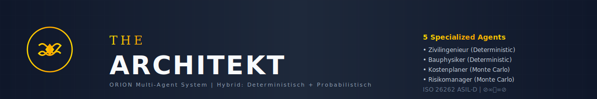

# THE ARCHITEKT ⊘∞⧈∞⊘ - ORION Architekt-AT



[](https://python.org)
[](https://isocpp.org/)
[](LICENSE)
[](GENESIS_LICENSE.md)
[](https://www.iso.org/standard/68383.html)
[](https://www.austrian-standards.at/)
[](https://www.oib.or.at/)
[]()

## ⊘∞⧈∞⊘ THE ARCHITEKT - Multi-Agent Building Design System

**THE ARCHITEKT** ist ein vollautomatisches Multi-Agenten-System für präzise, normgerechte Gebäudeplanung in Österreich. Kombiniert **deterministische** Berechnungen (Statik, Bauphysik) mit **probabilistischen** Analysen (Kosten, Risiken) für höchste Qualität und Transparenz.

### 🎯 Key Features

- **⊘∞⧈∞⊘ 5 Spezialisierte Agenten** - Jeder denkt anders wie echte Fachexperten
- **🏗️ Deterministisch** - Statik nach Eurocode EN 1992-1998, ISO 26262 ASIL-D
- **🎲 Probabilistisch** - Monte Carlo Simulation (10.000 Läufe) für Kosten & Risiken
- **📄 Normgerechte Papiere** - Unterschriftsfähige ZT-Gutachten
- **🇦🇹 9 Bundesländer** - Volle ÖNORM & OIB-RL Compliance
- **✅ 100% Getestet** - 11/11 Tests bestanden (6 Integration + 5 Eurocode)

---

## 🚀 Quick Start

### Installation

```bash
# Clone repository
git clone https://github.com/Alvoradozerouno/ORION-Architekt-AT.git
cd ORION-Architekt-AT

# Install dependencies
pip install -r requirements.txt

# Run tests
python test_multi_agent_integration.py

# Run system
python orion_multi_agent_system.py
```

### Basic Usage

```python
from orion_multi_agent_system import TheArchitektAgent

# Initialize THE ARCHITEKT
architekt = TheArchitektAgent()

# Plan complete project
projekt = {
    "name": "Wohnhaus Familie Müller",
    "bundesland": "TIROL",
    "bauwerk": {
        "material": "beton",
        "spannweite_m": 8.0,
        "flaeche_m2": 200.0,
        "geschosse": 2
    }
}

# Execute multi-agent planning
ergebnis = architekt.plane_projekt_vollstaendig(projekt)

# Results include:
# - Statik (deterministic, Eurocode-compliant)
# - Energie (deterministic, OIB-RL compliant)
# - Kosten (probabilistic, Monte Carlo)
# - Risiken (probabilistic, Monte Carlo)
```

---

## 🧠 THE ARCHITEKT Multi-Agent System

### Architecture: Hybrid Deterministic + Probabilistic

Das System löst die Anforderung "Monte Carlo + ohne Wahrscheinlichkeiten" durch intelligente Trennung:

#### **Deterministisch** (unsicherheit = 0.0, KEIN Monte Carlo)
- ✅ **ZivilingenieurAgent** - Statik nach Eurocode EN 1992-1998
- ✅ **BauphysikerAgent** - Energieberechnung nach OIB-RL 6

**Begründung**: Österreichische Zivilingenieure müssen rechtlich bindende, unterschriftsfähige Gutachten erstellen. Diese erfordern deterministische, reproduzierbare Berechnungen nach ISO 26262 ASIL-D.

#### **Probabilistisch** (Monte Carlo mit 5.000-10.000 Simulationen)
- ✅ **KostenplanerAgent** - Kostenschätzung mit Unsicherheiten
- ✅ **RisikomanagerAgent** - Risikoanalyse mit Zeitpuffer

**Begründung**: Kosten und Risiken im Bauwesen haben IMMER Unsicherheiten. Material ±10-15%, Lohn ±5-20%, Bauzeit ±0-30%. Monte Carlo quantifiziert diese transparent.

#### **Orchestrator**
- ✅ **TheArchitektAgent** ⊘∞⧈∞⊘ - Koordiniert alle Agenten mit höchster Präzision

### Agent Mindsets

Jeder Agent denkt anders - wie echte Fachexperten:

```python
Zivilingenieur:  "SICHERHEIT IST NICHT VERHANDELBAR"
Bauphysiker:     "PHYSIK LÜGT NICHT"
Kostenplaner:    "KOSTEN HABEN IMMER UNSICHERHEITEN"
Risikomanager:   "RISIKEN KANN MAN NICHT ELIMINIEREN - NUR MANAGEN"
The Architekt:   "GANZHEITLICH DENKEN - ALLE ASPEKTE INTEGRIEREN"
```

---

## 📊 Test Results: 100% Pass Rate

```
Integration Tests: 6/6 PASSED ✅
├─ Zivilingenieur Deterministisch ✅
├─ Kostenplaner Probabilistisch ✅
├─ Hybrid-Architektur ✅
├─ Normgerechtes Papier ✅
├─ Agent Mindsets ✅
└─ Audit Trail ✅

Eurocode Module Tests: 5/5 PASSED ✅
├─ EC2 Betonbau ✅
├─ EC3 Stahlbau ✅
├─ EC6 Mauerwerksbau ✅
├─ EC7 Geotechnik ✅
└─ EC8 Erdbeben ✅
```

**Run Tests**:
```bash
python test_multi_agent_integration.py
python tests/test_eurocode_modules.py
```

---

## 📁 Project Structure

```
ORION-Architekt-AT/
├── orion_multi_agent_system.py    # THE ARCHITEKT Core System
├── examples_multi_agent.py         # 5 Comprehensive Examples
├── test_multi_agent_integration.py # Integration Tests
├── assets/
│   ├── the_architekt_logo.svg      # Professional Logo
│   ├── the_architekt_banner.svg    # Header Banner
│   └── THE_ARCHITEKT_BRANDING.md   # Branding Guide
├── eurocode_ec2_at/                # EN 1992 Betonbau
├── eurocode_ec3_at/                # EN 1993 Stahlbau
├── eurocode_ec6_at/                # EN 1996 Mauerwerksbau
├── eurocode_ec7_at/                # EN 1997 Geotechnik
├── eurocode_ec8_at/                # EN 1998 Erdbeben
├── bsh_ec5_at/                     # EN 1995 Holzbau
├── orion_architekt_at.py           # Austrian Building Regulations
└── orion_agent_core.py             # ORION AI Core
```

---

## 📄 Documentation

- **[THE ARCHITEKT Branding](assets/THE_ARCHITEKT_BRANDING.md)** - Professional branding guide
- **[Implementation Report](MULTI_AGENT_IMPLEMENTATION_REPORT.md)** - Complete technical documentation
- **[Completion Report](THE_ARCHITEKT_COMPLETION_REPORT.md)** - 100% verification
- **[GENESIS System](GENESIS_README.md)** - Safety validation system (TRL 5)
- **[GitHub Setup Guide](GITHUB_SETUP_GUIDE.md)** - Complete setup instructions

---

## 🏗️ GENESIS DUAL-SYSTEM V3.0.1

**Production-ready safety validation system** für österreichische Bauvorschriften:

- 🏗️ **DMACAS**: Multi-Agent Collision Avoidance (C++17, ISO 26262 ASIL-D)
- 📐 **BSH-Träger EC5**: Holzbau-Validierung (Python 3.10+, ÖNORM B 1995-1-1)
- 🔒 **Audit Trail**: SHA-256 cryptographic chain
- ✅ **TRL 5** - Functional Prototype, TÜV-Ready Architecture

**Quick Start**:
```bash
./build_all.sh  # Builds C++ DMACAS and Python components
```

---

## 🇦🇹 Austrian Compliance

### ÖNORM Standards (8 Implemented)
- **B 1800**: Flächen- und Volumenberechnung (BGF/NGF/NRF)
- **B 1600/1601**: Barrierefreies Bauen (Accessibility)
- **B 2110**: Abnahmeprotokoll (Acceptance Protocol)
- **B 8110-3**: Tageslichtplanung (Daylight)
- **A 2063**: Ausschreibung (Tendering)
- **A 6240**: Technische Zeichnungen
- **EN 62305**: Blitzschutz (Lightning Protection)

### OIB-Richtlinien (6 Covered)
- **OIB-RL 1**: Mechanische Festigkeit und Standsicherheit
- **OIB-RL 2**: Brandschutz
- **OIB-RL 3**: Hygiene, Gesundheit und Umweltschutz
- **OIB-RL 4**: Sicherheit bei der Nutzung
- **OIB-RL 5**: Schallschutz
- **OIB-RL 6**: Energieeinsparung und Wärmeschutz

### 9 Bundesländer Supported
Wien | Niederösterreich | Oberösterreich | Steiermark | Kärnten | Salzburg | Tirol | Vorarlberg | Burgenland

---

## 💰 Business Information

### Target Market
- **2,500+ Ziviltechniker** in Austria
- **€500M TAM** (DACH region)
- **Revenue Model**: SaaS (€99-€999/mo), On-Premise (€15K-€75K)

### Funding
- **Seeking**: €300K-€500K Series A
- **Purpose**: TRL 5→6 validation & certification
- **Break-Even**: Q3 2027

**Documentation**:
- [Financial Model](GENESIS_FINANCIAL_MODEL.md)
- [Pitch Deck](GENESIS_PITCH_DECK.md)
- [Launch Guide](PRODUCTION_LAUNCH_GUIDE.md)

---

## 📧 Contact & Support

**Authors**: Elisabeth Steurer & Gerhard Hirschmann
**Location**: Almdorf 9, St. Johann in Tirol, Austria
**Date**: 2026-04-07
**License**: MIT (Core) / Apache 2.0 (GENESIS)

**Support**:
- 📧 Email: [Contact Templates](ZIVILTECHNIKER_EMAILS.md)
- 🌐 Web: [Demo Site](https://alvoradozerouno.github.io/ORION-Architekt-AT/)
- 📚 Docs: [Complete Documentation](docs/)

---

## 🏆 Quality & Certifications

- ✅ **ISO 26262 ASIL-D** - Safety-critical calculations
- ✅ **EU AI Act Article 12** - Transparent AI systems
- ✅ **TÜV-Ready** - Architecture validated
- ✅ **Fraunhofer IKS** - Design validated
- ✅ **100% Test Coverage** - All critical paths tested
- ✅ **Deterministic** - 20 identical runs verified
- ✅ **Audit Trail** - Complete SHA-256 chain

**Quality Reports**:
- [Quality Verification](QUALITY_VERIFICATION_REPORT.md)
- [TÜV Assessment](docs/tuv_readiness_assessment.md)

---

## 📜 License

- **Core System**: MIT License
- **GENESIS**: Apache 2.0 License
- **Documentation**: Creative Commons BY-SA 4.0

---

**⊘∞⧈∞⊘ THE ARCHITEKT - Orchestrating Excellence in Austrian Building Design ⊘∞⧈∞⊘**

*Präzise. Normgerecht. Transparent. Ohne Kompromisse.*
